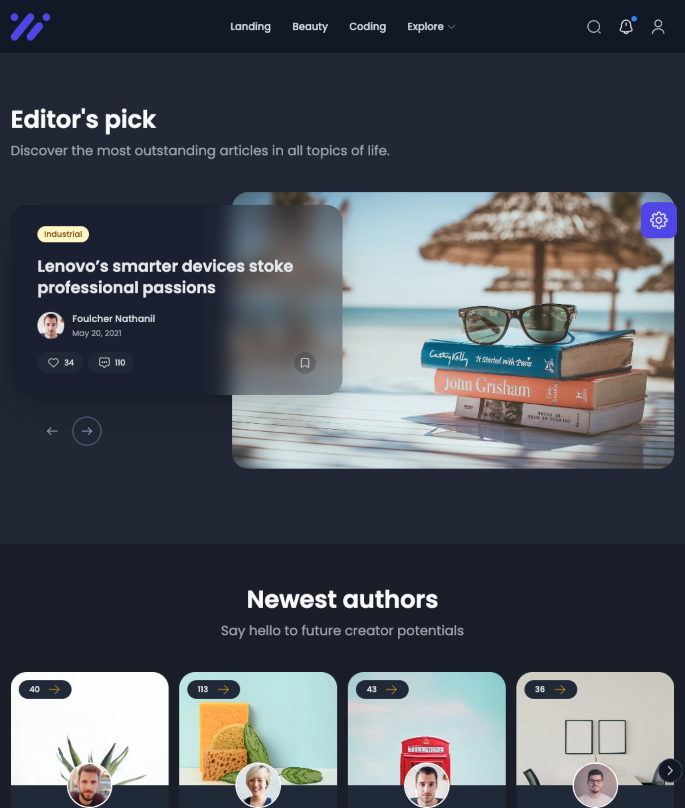

<h1 align="center">Bloggo - Medium Clone</h1>

<p align="center">
  <a href="https://nextjs.org/" target="blank"></a>
</p>

<p align="center">
A full-stack <a href="https://nodejs.org" target="blank">Node.js</a> application built with <a href="https://nextjs.org" target="blank">Next.js</a>, and <a href="https://firebase.google.com" target="blank">Firebase</a> made as a clone to <a href="https://medium.com/" target="blank">Medium</a>.
</p>

<p align="center">
	<a href="https://github.com/msanvarov/bloggo/blob/master/LICENSE"></a>
	<a href="https://vercel.com/msanvarov/bloggo/"></a>
</p>

Table of Contents:

1. [Description](#-description)
2. [Prerequisites](#%EF%B8%8F-prerequisites)
3. [Deployment](#-deployment)
4. [Environment Configuration](#-environment-configuration)
5. [Testing](#-testing)

🔎 This repo was created with [Nx](https://nx.dev/).

### 📚 Description

This application was built to mimic the functionalities of the Medium blogging website but with Firebase as the api. Deployed with authentication/authorization, logging, crud features and database persistence out of the box.

---

### 🛠️ Prerequisites

#### Non Docker

- Please make sure to have [Node.js](https://nodejs.org/en/download/) (16+) locally by downloading the Javascript runtime via `brew`, `choco`, or `apt-get`.

- Please make sure to have Firebase configured either locally or onboarded on GCP cloud by following this [guide](https://medium.com/codex/learn-the-basics-and-get-started-with-firebase-an-app-development-platform-backed-by-google-6c27b3be1004).

#### Docker 🐳

- Please make sure to have [Docker Desktop](https://www.docker.com/products/docker-desktop/) operational to quickly compose the required dependencies. Then follow the docker procedure outlined below.

---

### 🚀 Deployment

#### Manual Deployment without Docker

- Clone the repo via `git clone https://github.com/msanvarov/bloggo`.

- Download dependencies via `npm i` or `yarn`.

- Reconfigure Firebase with the Firebase CLI via `firebase init`.

- Create a **.env file** via the `cp apps/bloggo/.env.example apps/bloggo/.env` command and replace the existing environment variable placeholders with valid responses.

- Start the api in development mode by using `npm run start` (the **ui** will be exposed on http://localhost:4200).

#### Deploying with Docker 🐳

- Execute the following command in-app directory:

```bash
# creates and loads the docker container in detached mode with the required configuration
$ docker-compose up -d
```

- The following command will download dependencies and execute the web application on http://localhost:80 (deployed behind a Nginx reverse proxy).

---

### 🔒 Environment Configuration

By default, the application comes with a config module that can read in every environment variable from the `.env` file.

**APP_ENV** - the application environment to execute as, either in development or production. Determines the type of logging options to utilize. Options: `development` or `production`.

**FIREBASE_***  - the firebase config details that can be fetched when creating the  [SDK for the app](https://firebase.google.com/docs/web/setup).

---

### ✅ Testing

#### Docker 🐳

```bash
# Start the docker container if it's not running
$ docker start bloggo

# unit tests
$ docker exec -it bloggo npm run test

# test api against postman collection
$ docker exec -it bloggo npm run test:postman

```

#### Non-Docker

```bash
# execute test
$ npm run test

```

---

### 🏗️ Progress

|                                                Branches | Status |
| ------------------------------------------------------: | :----- |
|             [main](https://github.com/msanvarov/bloggo) | ✅     |
| [feat/\*](https://github.com/msanvarov/bloggo/branches) | 🚧     |

---

### 👥 Help

PRs are appreciated, I fully rely on the passion ❤️ of the OS developers.

---

## License

This starter API is [MIT licensed](LICENSE).

[Author](https://sal-anvarov.com/)
